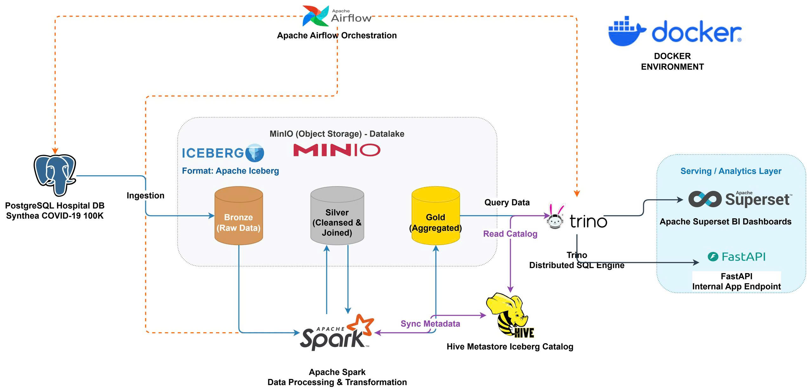

# Healthcare Data Lakehouse: COVID-19 Analytics Platform

[](https://github.com/darktheDE/healthcare-lakehouse-covid19)
[](https://github.com/darktheDE/healthcare-lakehouse-covid19)
[](https://github.com/darktheDE/healthcare-lakehouse-covid19)

## Project Overview
This project implements a professional **End-to-End Data Lakehouse** solution designed to process and analyze large-scale healthcare data, specifically focused on **COVID-19 patient records**. 

By leveraging the **Medallion Architecture (Bronze, Silver, Gold)**, the platform transforms raw transactional data from a hospital's legacy system into high-quality, aggregated insights. The system is built with a focus on **Decoupled Storage and Compute**, ensuring high scalability, ACID reliability via **Apache Iceberg**, and high-speed SQL analytical capabilities via **Trino**.

### Key Objectives
*   **Scalability:** Containerized microservices using Docker, ready for Kubernetes migration.
*   **Data Integrity:** Full ACID transaction support on a Data Lake using Apache Iceberg.
*   **Performance:** Distributed processing with Apache Spark and MPP querying with Trino.
*   **Accessibility:** Insights delivered via interactive BI Dashboards (Superset) and RESTful APIs (FastAPI).

---

## System Architecture
The architecture follows the **Modern Data Stack** pattern:

1.  **Ingestion & Orchestration:** `Apache Airflow` extracts data from `PostgreSQL` (Hospital DB).
2.  **Storage Layer:** `MinIO` (S3-compatible Object Storage).
3.  **Table Format & Catalog:** `Apache Iceberg` managed by `Hive Metastore`.
4.  **Processing Layer:** `Apache Spark` handles the Medallion ETL pipeline.
5.  **Serving Layer:** `Trino` provides a distributed SQL interface.
6.  **Analytics & Consumption:** `Apache Superset` (BI) and `FastAPI` (Data-as-a-Service).




---

## Tech Stack
| Category | Technology |
| :--- | :--- |
| **Source Database** | PostgreSQL (OLTP) |
| **Orchestration** | Apache Airflow |
| **Data Processing** | Apache Spark (PySpark) |
| **Data Lake Storage**| MinIO (S3 Compatible) |
| **Table Format** | Apache Iceberg |
| **Data Catalog** | Hive Metastore |
| **Query Engine** | Trino (Distributed SQL) |
| **BI Tool** | Apache Superset |
| **Backend API** | FastAPI (Python) |
| **Environment** | Docker & Docker Compose |

---

## Project Structure
```bash
.
├── api/                   # FastAPI source code & endpoints
│   ├── main.py
│   └── utils/             # Trino connection helper
├── dags/                  # Airflow DAGs for ETL orchestration
│   └── ingest_hospital_data.py
├── deploy/                # Infrastructure deployment
│   ├── docker-compose.yml # Main service stack
│   ├── spark/             # Spark custom configurations
│   ├── trino/             # Trino catalog properties
│   └── hive/              # Hive Metastore configurations
├── spark_jobs/            # Spark processing scripts (Medallion)
│   ├── bronze_ingestion.py
│   ├── silver_cleansing.py
│   └── gold_aggregation.py
├── data/                  # Sample Synthea CSV datasets
├── docs/                  # Project documentation & Proposal
└── README.md
```

---

## Getting Started

### Prerequisites
*   Docker & Docker Compose (Min 16GB RAM recommended)
*   Python 3.9+
*   DBeaver (optional, for SQL inspection)

### Installation
1. **Clone the repository:**
   ```bash
   git clone https://github.com/darktheDE/healthcare-lakehouse-covid19.git
   cd healthcare-lakehouse-covid19
   ```

2. **Spin up the infrastructure:**
   ```bash
   docker-compose -f deploy/docker-compose.yml up -d
   ```

3. **Verify Services:**
   *   **Airflow:** `http://localhost:8080` (Admin/Admin)
   *   **MinIO:** `http://localhost:9001` (Console)
   *   **Superset:** `http://localhost:8088`
   *   **FastAPI Docs:** `http://localhost:8000/docs`

---

## The Medallion Pipeline
1.  **Bronze (Raw):** Exact copy of source data from PostgreSQL, stored in Iceberg format with full history.
2.  **Silver (Filtered/Joined):** Data is cleaned (handling nulls, casting dates) and joined across `patients`, `encounters`, and `conditions`.
3.  **Gold (Aggregated):** Business-level tables (e.g., `revenue_analysis`, `covid_trends`) optimized for fast analytical dashboarding.

---

## Data Consumption

### BI Dashboard (Apache Superset)
*   **Revenue Analysis:** Track hospital income by region and period.
*   **Epidemic Trends:** Monitor COVID-19 infection rates and demographics.

### Data API (FastAPI)
Access processed insights programmatically:
*   `GET /api/v1/revenue/summary` - Returns monthly revenue JSON.
*   `GET /api/v1/covid/trends` - Returns weekly infection statistics.

---

## Contributors
This project was developed by **Team 01 (BDAN-HCMUTE)** using the Agile/Scrum methodology.

*   **Đỗ Kiến Hưng (DE):** Infrastructure, Airflow Orchestration, Bronze Spark Job.
*   **Nguyễn Văn Quang Duy (DE):** Silver Spark Job, Trino Optimization, Superset Dashboards.
*   **Phan Trọng Quí (BE):** Docker Setup, PostgreSQL Source, Gold Spark Job (Revenue), FastAPI.
*   **Phan Trọng Phú (BE):** MinIO Setup, Gold Spark Job (Trends), FastAPI.

---

## License
This project is licensed under the MIT License - see the [LICENSE](LICENSE) file for details.

---
**Acknowledgment:** Dataset provided by **Synthea™ (MITRE)**. Built for the **Big Data Analysis** course.